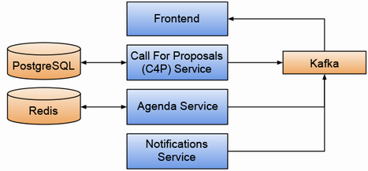

# end-to-end-microservices-with-docker-kubernetes-terraform-github-actions
In this project, we will be building microservices applications by deploying complex microservices application to production using Docker, Kubernetes, Terraform, Github Actions and Google Cloud Platform (GCP)

### Activities
In the course of this project i will be doing the following:

* Create individual microservices
* Package and publish microservices using Docker
* Develop a microservices application on  development computer using Docker Compose
* Test my code, microservices, and application using Jest and Playwright
* Integrate third-party servers into my application (like MongoDB and RabbitMQ, as examples)
* Communicate between microservices using HTTP and RabbitMQ messages
* Store the data and files my microservices need to operate
* Deploy my microservices to a production Kubernetes cluster on GCP
* Create production infrastructure using Terraform
* Create a continuous deployment pipeline that automatically deploys my application as i push changes to my code repository on GitHub

### Tools

* **Docker:** To package and publish our services
* **Docker Compose:** To test our microservices application on our development computer
* **Kubernetes:** To host our application in the cloud
* **Terraform:** To build our production infrastructure in the cloud
* **GitHub Actions:** To build a continuous deployment pipeline.

## The Microservice Application
  

Core Services: FrontEnd, C4P Service, Agenda Service, Notifications Service

Databases: PostgreSQL, Redis

Message Broker: Kafka
