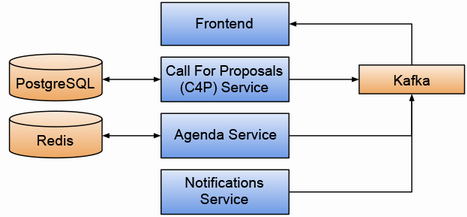

## The Microservice Application
  

Core Services: FrontEnd, C4P Service, Agenda Service, Notifications Service

Databases: PostgreSQL, Redis

Message Broker: Kafka

run initial code locally with:

npm i && run dev 