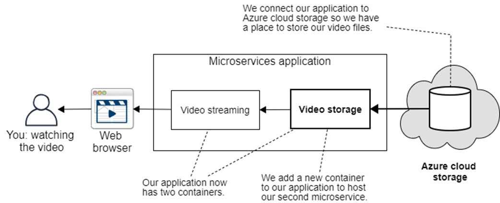

## Introduction

## Using Azure Storage

Creating an Azure Storage account

Uploading your video to Azure Storage

Creating a microservice to read Azure Storage 

( A quick note: in case you were thinking of porting the code presented here over to AWS or GCP, converting from the Azure store microservice over to another provider is not a simple task. The APIs to interface with AWS and GCP storage will be quite different to Azure, and you’ll need to read their docs separately to figure out how to use them. Make sure you finish learning about the Azure storage microservice in this chapter before you attempt to convert to any other provider.)

Testing our new microservice independently

## Updating the video-streaming microservice

## Adding our new microservice to the Docker Compose file

## Testing the updated application

## Cloud storage vs. cluster storage

## Using Google Cloud Storage

## Using Amazon S3

## Using Minio

