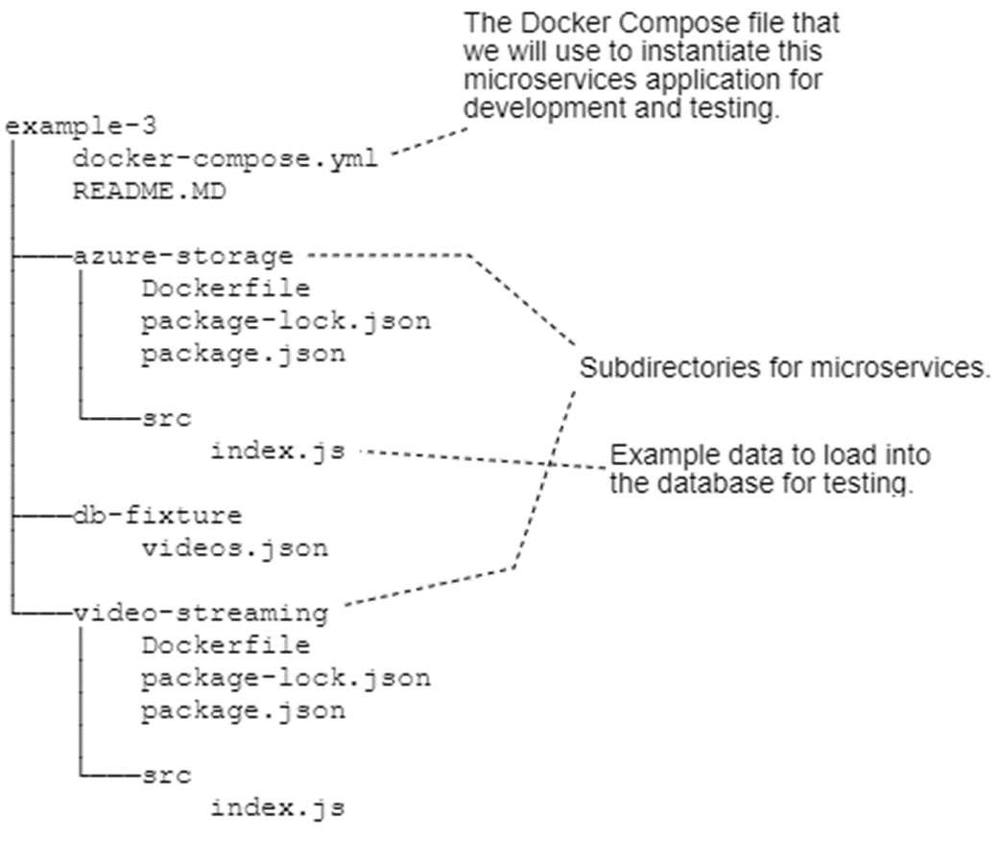

# how to integrate databases, Redis and Postgresql, with microservices application.

## Introduction

## Why Redis and PostgreSQL

## Adding a database server in development

We are going to add a database to our application in development using
Docker Compose in the same way that we added our video-storage
microservice earlier in this chapter. Now in example-3 we will add one new
container to our Docker Compose file to host a single database server. We
only need a single server, but we can host many databases on that server.
This means we’ll be set up for the future to easily create more databases as
we add more microservices to our application. The layout of example-3 as
you can see in figure 4.15 is mostly the same as example-2, except now we
have the addition of a JSON file that contains some test data that we will add
to our database.

## Adding the database server to the Docker Compose file

## Database-per-microservice or database-per-application?

